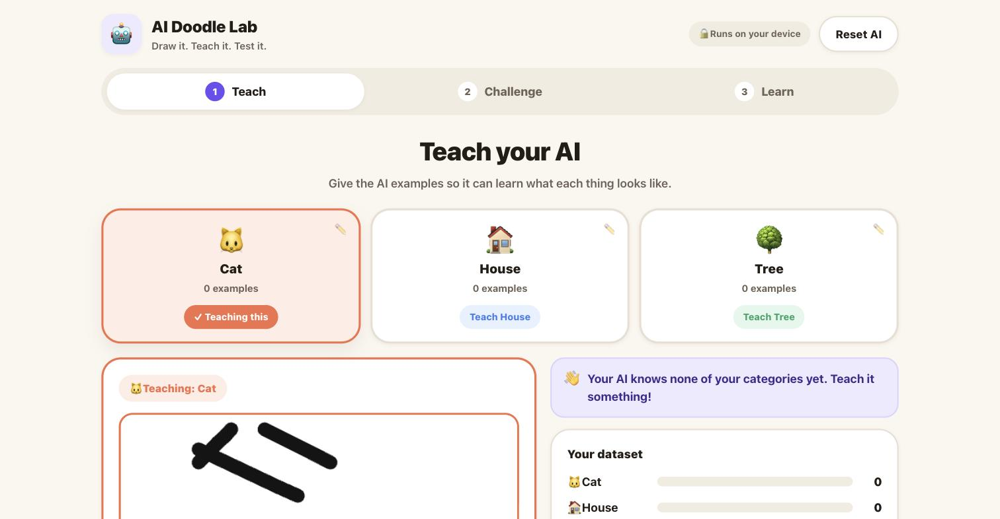
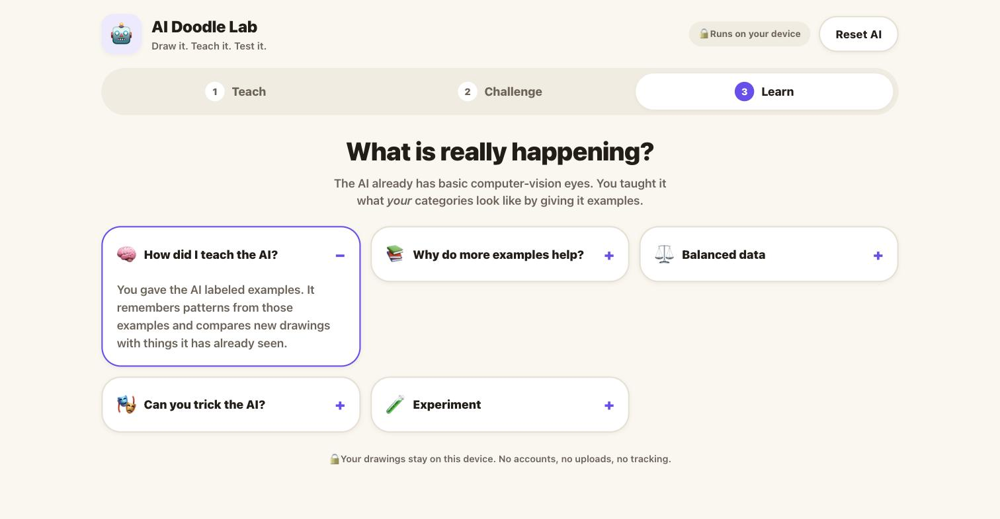

# 🤖 AI Doodle Lab

**Draw it. Teach it. Test it.**


[](https://github.com/Drip1n/ai-doodle-lab/actions/workflows/ci.yml)

AI Doodle Lab is a kid-friendly, browser-based machine learning workshop where students teach an
AI to recognize their own drawings — and immediately test what it has learned.  

🌐 Live Demo: https://fontys-ai-lab.milansmiesko.nl


<p align="center">
  
</p>

<p align="center"><em>Built as a workshop tool for Fontys ICT.</em></p>

<p align="center">
  
</p>

---

## ✨ What is it?

Kids go through a short, hands-on ML loop:

1. **Draw** an example of one of their categories
2. **Label** it
3. **Teach** the AI by adding it to the dataset
4. **Draw** something new
5. Let the **AI guess**
6. Turn mistakes into new training examples and try again

**Draw → Label → Teach → Test → Improve**

Along the way it demonstrates real machine learning ideas in a way that's tangible, not abstract:

- labeled training data
- classification
- dataset balance
- variation in examples
- model mistakes
- iterative improvement

## 🎮 How it works

The app has three stages:

### 1. Teach
Give the AI examples for your own categories by drawing (or uploading) pictures and labeling them.

Categories are not fixed:

- three starter categories are picked automatically on first run (and on reset)
- any category can be renamed
- its emoji can be changed, or removed entirely — a category can be just a name
- more categories can be added (up to 6)
- categories can be deleted, along with everything the AI learned for them

### 2. Challenge
Three modes:

- **✏️ You draw** — draw something new, unlabeled, and let the AI guess what it is, with a class
  score per category. Got it wrong? Turn that drawing into a new training example on the spot.
- **🤖 AI draws** — a pretrained **sketch-generation** model invents a brand new drawing and
  animates it stroke by stroke. Guess what it is before it finishes. This is the counterpart to
  You Draw: *generating* instead of *recognizing*.
- **🧠 Memory** — can you remember what the AI learned?

### 3. Learn
Friendly explainer cards cover *why* examples, dataset balance, and variation matter, a side-by-side
"two kinds of AI" comparison of the classifier and the generator, plus a few experiments to try live.

> The app uses **MobileNet** as a pretrained visual feature extractor and a **KNN classifier** for
> the workshop-specific categories. We are **not** training a complete neural network from scratch —
> MobileNet's weights are never modified.

<p align="center">
  
</p>

## 🚀 Run locally

```bash
git clone https://github.com/Drip1n/ai-doodle-lab.git
cd ai-doodle-lab
npm install
npm run dev
```

Then open the URL Vite prints (typically **http://localhost:5173**).

For a production build:

```bash
npm run build
npm run preview
```

## 📋 Requirements

- Node.js 20+ (CI runs Node 24)
- npm
- A modern browser (Chrome, Firefox, Safari, Edge)

An internet connection is needed the first time the app loads, to download the MobileNet weights
(~17 MB) from Google's model host. Your browser may cache the downloaded models, making later loads
faster and potentially reducing network use — but browser caching is not a guarantee, so do not
plan a session around the app working offline.

**AI Draws** likewise needs internet the first time it uses a given drawing category, to fetch that
category's ~3 MB Sketch-RNN model. Once loaded, generation itself is entirely local.

## 🧠 Machine learning

- **TensorFlow.js** runs the model entirely client-side.
- **MobileNet** turns each drawing into a compact set of visual features (an embedding). It is used
  purely as a fixed feature extractor and is never retrained.
- A **KNN classifier** remembers the embeddings of the examples a student labels, then compares new
  drawings against them to make a prediction. Its per-category numbers are **class scores** — how
  strongly the classifier matched each category — not calibrated probabilities.
- Training examples and predictions never leave the browser.

```text
Classifier path (You Draw)        Generator path (AI Draws)

Drawing                           Sketch-RNN decoder
   ↓                                 ↓
MobileNet                         stroke sequence
   ↓                                 ↓
Visual features                   animated canvas
   ↓
KNN classifier
   ↓
Your own categories
```

### AI Draws (sketch generation)

AI Draws uses Google Magenta's pretrained **Sketch-RNN** checkpoints — one small (~3 MB) model per
category, trained on the **Quick, Draw!** dataset. Each round samples a *new* stroke sequence from
the model; nothing is replayed from the dataset and nothing is selected from a library of images.

- Models are downloaded **lazily**, one category at a time. The five most recently used stay in
  memory; older ones are disposed (tensors and all) so a long workshop cannot grow unbounded. A
  model that is needed again is fetched again, usually straight from the browser's HTTP cache.
  Nothing is bundled into the app.
- `src/generative/` contains a minimal decoder-only Sketch-RNN runtime (~250 lines) built on the
  TensorFlow.js already in the app. The `@magenta/sketch` package pins TensorFlow.js 1.x, which
  would pull a second, much older copy of TF into the bundle, so only the parts actually needed to
  load and sample the published `.gen.json` checkpoints are reimplemented.
- Generation runs entirely in the browser — no backend, no API key. Sampling a whole sketch takes
  roughly **200–400 ms** on a laptop CPU.
- The generator is completely separate from the classifier. It has never seen anything a student
  taught their own AI, and the app says so in the UI.
- 24 categories are shipped, each verified to download and generate: cat, dog, rabbit, pig, sheep,
  owl, penguin, duck, bee, spider, snail, mosquito, whale, octopus, crab, lobster, bus, truck,
  helicopter, bicycle, flower, cactus, palm tree, pineapple.

## 🔒 Privacy

- No account required
- No analytics
- No tracking
- Drawings are processed locally in the browser — "Upload image" reads a file into the page, it
  does not send it anywhere
- AI Draws downloads pretrained model weights, but sends nothing: no drawing, guess or score ever
  leaves the device
- Images are not uploaded to any server — everything (examples, predictions, dataset) is stored
  on-device via IndexedDB

## 🧑‍🏫 Workshop use

A suggested 10-minute activity for a classroom or booth:

1. Give each category just 2 examples. (The starter set is random — for example Cat, House and
   Tree — and can be renamed or replaced.)
2. Test the AI in Challenge mode.
3. Observe where it gets confused.
4. Add more, more varied examples for the categories it struggled with.
5. Test again.
6. Discuss: what changed, and why?

> **Workshop question:** "What kind of data helped your AI improve?"

Facilitator notes:
- "Challenge success rate" reflects this session's challenges only — it isn't a model accuracy metric.
- The percentages next to a guess are **classifier scores, not guaranteed probabilities**. They are
  shown because they make the comparison visible, not because they are calibrated.
- Category names, icons and the category list itself are all editable (pencil icon on each card).
- **Reset AI** clears every example, category, and score, and asks for confirmation first.
- On the Learn page, "Show me" uses a picture the AI already learned from — the app says so on
  screen. "Or draw something new" is the genuinely unseen test.

## 🧰 Workshop preparation

Before the session:

1. Open the live site on the workshop network.
2. Let the initial AI model finish loading.
3. Open AI Draws once to verify model downloads are allowed through the network.
4. Confirm the browser can use IndexedDB/local storage (the app warns on screen if it cannot).
5. Keep internet available for models that have not yet been cached.

Doing this once per device before the workshop is the single biggest reliability win.

## 🛠 Tech stack

- React 19
- TypeScript
- Vite
- TensorFlow.js
- MobileNet (`@tensorflow-models/mobilenet`)
- KNN Classifier (`@tensorflow-models/knn-classifier`)
- Sketch-RNN (pretrained Magenta checkpoints, loaded directly)

## 📁 Project structure

```text
src/
  components/    UI: canvas, class cards, memory wall, challenges, learn cards, loader
  ml/            classifier.ts (MobileNet + KNN), loadStages.ts (startup stages),
                 imageProcessing.ts (shared 224x224 pipeline)
  generative/    sketchGenerator.ts (Sketch-RNN runtime), modelCache.ts (bounded LRU),
                 supportedModels.ts, strokeUtils.ts
  hooks/         useAiLab.ts — all app state and actions
  storage/       db.ts — IndexedDB persistence
  styles/        base.css (tokens + primitives), app.css (components)
  types/         shared types and class definitions
```

## 🗺 Future ideas

These are possibilities, not existing features:

- webcam training
- team competitions
- save/export trained datasets
- teacher dashboard
- additional workshop modes

## 🙏 Credits

- **Sketch-RNN** models and format by the [Magenta](https://github.com/magenta/magenta-js) team at
  Google, described in [*A Neural Representation of Sketch Drawings*](https://arxiv.org/abs/1704.03477)
  (Ha & Eck, 2017). The checkpoints are served from Google's public `quickdraw-models` bucket.
- The models were trained on the [**Quick, Draw!** dataset](https://github.com/googlecreativelab/quickdraw-dataset)
  by Google Creative Lab, licensed **[CC BY 4.0](https://creativecommons.org/licenses/by/4.0/)**.
- **MobileNet** weights by Google, via `@tensorflow-models/mobilenet`.
- Built as a workshop tool for **Fontys ICT**; the Fontys ICT mark is used with that context in
  mind and remains the property of Fontys.

## 📄 License

[MIT](LICENSE)
