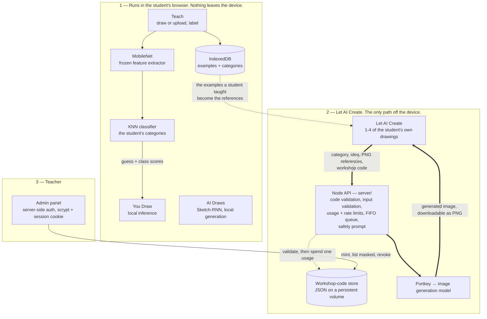
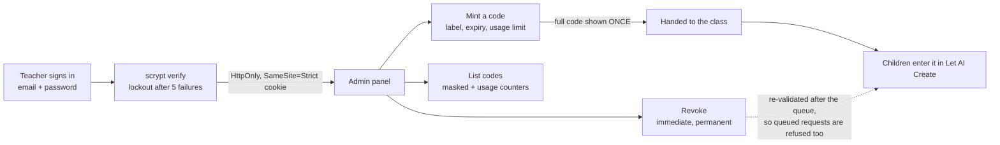
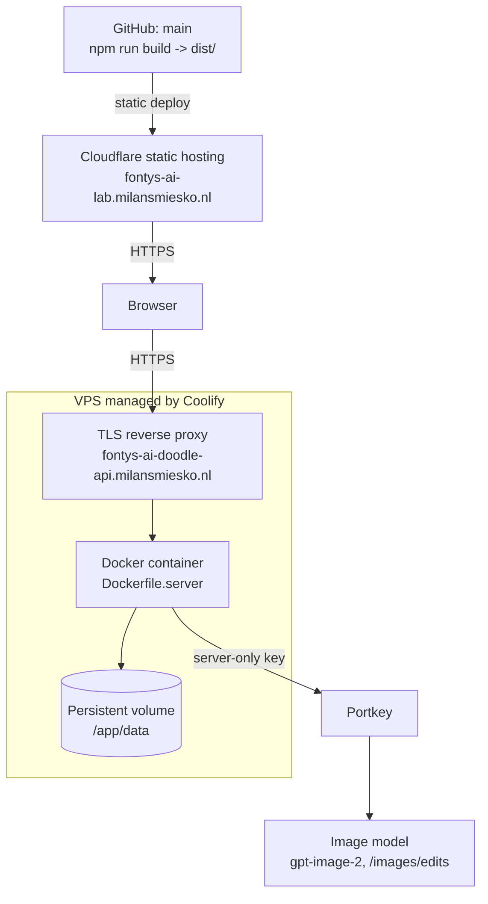
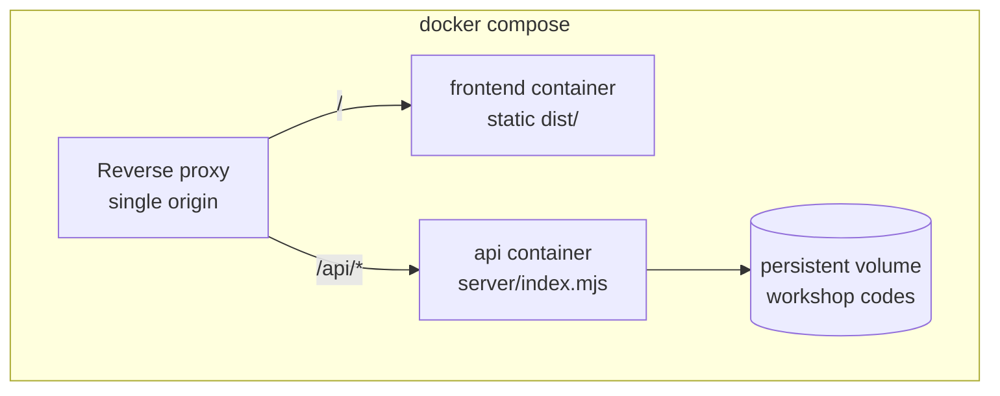

# 🤖 AI Doodle Lab

**A browser-based workshop where children teach an AI to recognise their own drawings — then watch a
second AI turn those drawings into a picture.**


[](https://github.com/Drip1n/ai-doodle-lab/actions/workflows/ci.yml)

🌐 **Live:** <https://fontys-ai-lab.milansmiesko.nl/> · **API health:**
<https://fontys-ai-doodle-api.milansmiesko.nl/api/health>

A child draws a few cats, labels them, and a classifier running entirely in their browser starts
recognising cats. Then they pick those same drawings, choose a look and a world, and a hosted image
model turns them into something new they can download.

Two kinds of AI, side by side, on a tablet — one that runs on the device and one that does not. The
difference between them is the lesson.

<p align="center">
  
</p>

<p align="center"><em>Built as a workshop tool for Fontys ICT.</em></p>

<p align="center">
  
</p>

---

## Why this exists

Children meet "AI" as a finished thing: it already knows, it already draws, and the interesting part
is hidden. That makes it feel like magic, and magic cannot be reasoned about.

AI Doodle Lab is a workshop tool for Fontys ICT open days, school visits and booths. It is built for
a short hands-on session — the suggested core activity takes about ten minutes — with roughly
fifteen children aged 8–12, on tablets or laptops, on an unpredictable guest network.

The learning objective is small and concrete: **a child should leave able to say what their AI
learned from, why it got something wrong, and what they changed to fix it** — and able to point at
the difference between the AI running on their tablet and the one that is not.

That shapes every constraint in the repository. No accounts, no analytics, no setup per device. The
recognition half needs no backend of ours at all, so a class is never blocked by a server being
down. The generation half costs money and touches a third party, so it sits behind a teacher-issued
code, a queue and a usage limit.

## What students experience

Three stages in the app — **Teach**, **Challenge** and **Learn** — with the Challenge stage holding
four things to try.

### 1. Teach

Draw or upload examples for your own categories and label them. Categories are not fixed: three
starter ones are picked on first run, any can be renamed, its emoji changed or removed, up to six
can exist, and deleting one deletes everything the AI learned for it.

### 2. You Draw

Draw something new and unlabelled, and let the AI guess, with a score per category. Got it wrong?
Turn that drawing into a training example on the spot and try again.

### 3. AI Draws

A pretrained sketch-generation model invents a brand new drawing and animates it stroke by stroke.
Guess what it is before it finishes. This is the counterpart to You Draw: *generating* instead of
*recognising* — and it still runs on the device.

### 4. Let AI Create

Pick a category you have already taught. Up to four of your own drawings become the clues. Choose a
look, a world and a style, and a hosted image model makes a picture from them, which you can
download as a PNG — or **scan a QR code to save it on your own phone**, which is what a booth
needs when the machine making the picture is not the child's.

While it is being made, the panel shows an obvious "Creating your picture…" state rather than a
still screen, and a picture already on screen stays there until the new one really arrives. The
latest picture belongs to the session: wandering off to another challenge, or to Learn, and coming
back does not lose it.

This is the one place where something a child made leaves their device, and the app says so on
screen before they press the button. It needs a workshop code from the teacher — the field hides it
behind dots by default, with a **Show** button for checking what was typed.

There is a fourth Challenge tab, **Memory** — can you remember what the AI learned? — which makes a
good filler while others are waiting for a picture.

### 5. Learn and experiment

Explainer cards on why examples, dataset balance and variation matter, a side-by-side "two kinds of
AI" comparison of the classifier and the generator, and a few experiments to run live.

<p align="center">
  
</p>

## What students learn

| Idea | Where it shows up |
| --- | --- |
| Labelled datasets — an AI learns from examples *you* chose | Teach |
| Variation — six near-identical cats teach less than six different ones | Teach, then You Draw |
| Classification — sorting new input into known categories | You Draw |
| Feature extraction — the model sees shapes, not "cat" | Learn, visible in what confuses it |
| Model mistakes are information, not failure | You Draw, turning a wrong guess into an example |
| Iterative improvement — change the data, re-test, compare | The whole loop |
| Recognition is not generation — two different kinds of model | AI Draws next to You Draw, and the Learn cards |
| Local AI is not hosted AI — one runs here, one does not | Let AI Create, which says so before it sends anything |

> MobileNet is used as a **pretrained, frozen feature extractor**, with a **KNN classifier** on top
> for the student's own categories. No complete neural network is trained from scratch, and
> MobileNet's weights are never modified. The per-category numbers are **class scores** — how
> strongly each category matched — not calibrated probabilities.

## Architecture



The thick arrows are the only path on which anything a student made leaves their device. Everything
else — training, inference, sketch generation, storage — happens in the browser.

📖 Full detail, including sequence and trust-boundary diagrams:
**[docs/architecture.md](docs/architecture.md)**

## Local ML vs hosted generation

This split is the technical centre of the project and the educational point of it.

| | Teach / You Draw / AI Draws | Let AI Create |
| --- | --- | --- |
| Where inference runs | The student's browser | A hosted image model |
| What leaves the device | Nothing | Category name, the chosen idea string, 1–4 PNG thumbnails |
| Needs a server | No | Yes — ours, which holds the credential |
| Needs network | Only to download model weights | Yes, per picture |
| Costs money | No | Yes, per picture |
| Access control | None needed | Teacher-issued workshop code |
| Stored anywhere server-side | No | **Never on disk.** One copy of the finished picture is held in backend memory for ~30 minutes behind a random link, so a phone can scan it |

Two clarifications that are easy to get wrong in either direction:

- **"Local" does not mean "offline."** The first load downloads MobileNet (~17 MB) from Google's
  model host, and each AI Draws category downloads its own ~3 MB Sketch-RNN checkpoint the first
  time it is used. Browsers may cache both, but caching is not a guarantee — do not plan a session
  around the app working without network.
- **"Hosted" does not mean "stored."** The backend holds a student's references only for the life of
  the request. No drawing, prompt or generated image is ever written to disk; the only thing
  persisted server-side is workshop-code metadata. The QR handoff is the one deliberate exception
  to "transient": the finished picture is kept **in memory only**, behind a 256-bit random token,
  for about half an hour, and a restart drops every such link.

## Teacher controls

A small ⚙ in the bottom-left corner opens the admin panel. It is faded so it does not compete with
the workshop, but **that is tidiness, not security** — every route behind it is authenticated on the
server.



Each class gets its own code with its own lifetime and budget — there is no single global password.

- Codes are `PREFIX-XXXXXXXX` (~39 bits) from a 30-character alphabet with `I`, `L`, `O`, `U`, `0`
  and `1` removed, so a code read aloud cannot be mistyped into a different valid one.
- Only a salted hash is stored. **The full code is shown exactly once**, in the response that
  creates it; afterwards the panel shows only `FONTYS-A7•••`. A lost code is replaced, not
  recovered.
- A usage is spent when a provider call is **about to start**, never when a request merely arrives.
  Bad input, a wrong code, a full queue, a timeout or a disconnect all cost nothing.
- Revoking is immediate and permanent, and effective mid-workshop: a request already waiting in the
  queue is re-validated after it leaves and still refused.

📖 Codes, limits and auth in detail: **[docs/image-generation.md](docs/image-generation.md)** ·
Running a session: **[docs/workshop-runbook.md](docs/workshop-runbook.md)** ·
What the first real workshop changed: **[docs/workshop-feedback.md](docs/workshop-feedback.md)**

## Security, privacy and safety

**Privacy.** No account, no analytics, no tracking.

- Categories, examples, thumbnails, session scores and the latest generated picture live in the
  browser's IndexedDB. **Reset AI** clears them. Only the most recent picture is kept — there is no
  gallery — and only when it is inline image data; a picture the provider returned as a link is
  kept for the session but never stored, because its lifetime is not ours to promise.
- Teach, You Draw and AI Draws send nothing. "Upload image" reads a file into the page; it does not
  upload it anywhere.
- **Let AI Create is the exception.** Pressing Create sends the category name, the idea string the
  child assembled from three fixed option groups, and up to four PNG thumbnails of their own
  examples, through our backend to the image provider. The app states this on screen first.
- The backend writes **no** drawings, prompts or generated images to disk. The only thing it writes
  is workshop-code metadata: labels, hashes, expiry, usage counters.
- For the QR handoff, one copy of a finished picture is held in backend **memory**, behind a
  cryptographically random token that encodes nothing about the child or their code, for about 30
  minutes. The table is bounded (40 pictures, 64 MB), expired and oldest entries are evicted, and a
  restart drops all of them. `GET /api/shared-image/<token>` answers one generic `404` for anything
  unknown, malformed or expired. It takes no workshop code by design — the phone scanning it does
  not have one — so the random token is the whole capability.
- Nothing logs a provider key, a password, a full workshop code or a student image. There is a test
  that asserts it.

**Security.** Secrets are server-side only — `VITE_*` variables are public by construction and
never hold one. Exact-origin checks and CORS on every route; admin `POST`s additionally require an
`Origin` match, which with `SameSite=Strict` is the CSRF defence. Admin passwords are scrypt with a
per-user salt, verified with `timingSafeEqual`; an unknown email still runs a full scrypt against a
decoy hash, so the panel cannot be used to discover which teachers exist. Sessions are random
256-bit tokens in `HttpOnly` cookies, held server-side, with nothing in `localStorage`. Requests are
capped at 3 MB by destroying the socket rather than buffering, and every PNG reference is checked
for magic bytes and dimensions. The provider base must be `https:`, and generation parameters are
validated against fixed allow-lists at boot.

**Child safety.** The composed prompt names the subject, labels the child's text as untrusted and
non-instructional, and carries a safety clause that outranks everything after it: suitable for ages
8–12, with no violence, blood, weapons, gore, frightening imagery, nudity, sexual content, hateful
symbols, drugs, alcohol or likenesses of real people. It also instructs the model to ignore words or
markings inside the reference drawings.

> **Prompt wording is not moderation.** It is one layer. Provider-side moderation must be enabled in
> the Portkey workspace and in the model's own configuration — those live in the provider account,
> and this repository cannot set them. Keep an adult watching the screen; the usage limits exist
> partly so a bad result can be stopped by revoking a code.

📖 **[docs/image-generation.md](docs/image-generation.md)** ·
**[docs/architecture.md#trust-boundaries](docs/architecture.md#trust-boundaries)**

## Testing and quality

```bash
npm run lint         # oxlint
npm test             # Vitest — frontend units and component suites
npm run test:server  # node --test — store, codes, admin auth, queue, HTTP, scripts
npm run build        # tsc -b + production build
npm run test:e2e     # Playwright — real browser input
```

At the post-workshop iteration
[`82891a1`](https://github.com/Drip1n/ai-doodle-lab/commit/82891a1), on Node 26 (production runs
Node 24):

| Check | Result |
| --- | --- |
| `npm run lint` | clean |
| `npm test` | **143 passed** (12 files) |
| `npm run test:server` | **108 passed** |
| `npm run build` | passed |
| `npm run test:e2e` | **41 passed, 11 skipped** |

The 11 skips are deliberate, not failures: CDP touch injection is Chromium-only, so the touch
describe block is skipped on the WebKit project.

What each one protects:

- **`npm test`** — the image pipeline, loading stages, dataset helpers, the generation client's
  error-wording map, source validation and share-URL derivation, what the latest creation may
  promise across a reload, the lab's own creation lifecycle, the download filename and the two
  source shapes, the Sketch-RNN model cache's LRU and disposal, stroke maths, the admin API client,
  and the admin and Let AI Create components — the waiting state, the QR section and the
  workshop-code toggle included.
- **`npm run test:server`** — workshop-code validity and revocation, randomness and
  plaintext-never-stored, persistence across a restart, a malformed store failing closed, admin
  sign-in, lockout, session expiry and logout, code creation/listing/revocation, four-at-a-time
  concurrency with queue overflow and abort handling, usage counting under concurrency, the
  generation guards, the temporary phone-share store (token entropy, expiry, eviction, byte and
  item ceilings, one generic 404, nothing on disk) and that nothing sensitive is logged. **None of
  it uses a real API key or a real password.**
- **`npm run test:e2e`** — four suites:
  - `drawing-canvas.spec.ts`, the pointer-lifecycle regression net, with real touch and mouse input
    on desktop Chromium, mobile Chromium and mobile WebKit. Needs no network; it mounts the canvas
    on its own dev-only harness page (`e2e/harness/`).
  - `workshop.spec.ts`, the workshop-critical paths against the real app. Downloads MobileNet, so it
    needs network, and runs on mobile Chromium only.
  - `admin.spec.ts`, the teacher's path end to end: open the panel, sign in, hand out a code once,
    see it masked, revoke it, sign out. The Node server is mocked at the network layer, so it needs
    no provider key.
  - `create.spec.ts`, Let AI Create in Live mode against its own Vite server: the code toggle, the
    waiting state, the QR code, a picture surviving a walk to another challenge and back, and the
    download. The Node server is mocked, so it needs no provider key and bills nothing.

Run just the fast ones with `npm run test:e2e:canvas`; browsers need installing once with
`npx playwright install --with-deps`.

CI runs lint, both unit suites, the build and the Chromium E2E projects on every push and pull
request. `main` and `develop` both require it and reject force pushes and deletions.

## Production deployment



The frontend is a static bundle built from `main`; the backend is one Docker container with a volume
and a TLS reverse proxy in front. Production runs `IMAGE_QUALITY=medium` and `IMAGE_SIZE=1024x1024`.

**Cloudflare is not required by the architecture — it is the current deployment choice.** The
frontend is a plain static bundle with a single entry point: no server-side rendering, no edge
functions, no `_worker.js`, no `_routes.json`, no framework adapter. Any static host that serves
`dist/` over https works identically. The same is true of Coolify: it is a convenient way to run a
container with a volume and TLS, and any Docker host does the job.

📖 **[docs/deployment.md](docs/deployment.md)** — full topology, environment-variable categories,
health endpoint, redeploy and rollback, and the single-instance limitation.

## Run locally

### Demo mode — the default, no key, no server

```bash
git clone https://github.com/Drip1n/ai-doodle-lab.git
cd ai-doodle-lab
npm install
npm run dev
```

Open the URL Vite prints (typically <http://localhost:5173>). Teach, You Draw, AI Draws and Learn
all work fully. Let AI Create previews the idea a child assembled and generates nothing.

For a production build: `npm run build && npm run preview`.

### Live mode — with real picture generation

Needs your own Portkey workspace and Node.js 22.9+ (24 recommended).

1. `cp .env.example .env.local` and `cp .env.server.example .env.server.local`.
2. In `.env.local`: `VITE_IMAGE_MODE=live` and `VITE_IMAGE_ENDPOINT=/api/generate-image`.
3. In `.env.server.local`: `IMAGE_MODEL`, `IMAGE_OPERATION`, one of `PORTKEY_CONFIG_ID` /
   `PORTKEY_VIRTUAL_KEY`, and `PORTKEY_API_KEY`. **Never put a key in a `VITE_*` variable** — those
   are compiled into the public bundle.
4. Create an admin:

   ```bash
   npm run admin:hash-password -- teacher@example.com
   ```

   It asks for the password twice without echoing, then prints the exact `ADMIN_USERS_JSON=` line to
   paste in. The single quotes matter: the scrypt hash contains `$`. Plaintext passwords never go in
   the file, and never in Git.
5. `npm run server` in one terminal, `npm run dev` in another. Vite proxies `/api` to port 8787.
   Restart both after changing an environment file.
6. Open the app, press the ⚙ in the bottom-left, sign in, and mint a code. **Copy it — it is shown
   once.**
7. Add examples in Teach, open Challenge → Let AI create, enter the code, create a picture.

📖 **[docs/image-generation.md](docs/image-generation.md)**

### Requirements

- Node.js 20+ for the frontend, **22.9+ for the backend** (CI and the container run Node 24)
- npm, and a modern browser
- Network on first load, for the MobileNet weights

## Deploying the backend

`Dockerfile.server` builds the backend **only**. The Vite frontend is deliberately not built into
it: it is a static bundle that belongs on the static host, and building it would pull TensorFlow and
React into an image that never serves them. There is no `npm ci` either — every module under
`server/` imports only `node:` built-ins, so the backend has no package to install.

```bash
docker build -f Dockerfile.server -t ai-doodle-api .
docker run -d --name ai-doodle-api \
  -p 3000:3000 \
  -v ai-doodle-data:/app/data \
  --env-file .env.server.local \
  ai-doodle-api
```

**Mount the volume at `/app/data`.** Without it, every redeploy starts with an empty store: every
workshop code stops working and every usage counter resets.

Runtime environment, by category — the full annotated lists are in
[`.env.server.example`](.env.server.example):

| Category | Variables |
| --- | --- |
| Secrets (server-only) | `PORTKEY_API_KEY`, `ADMIN_USERS_JSON` |
| Required for Live | `APP_ORIGIN`, `IMAGE_MODEL`, `IMAGE_OPERATION`, one of `PORTKEY_CONFIG_ID` / `PORTKEY_VIRTUAL_KEY` |
| Strongly recommended | `WORKSHOP_STORE_PATH` on the volume, `TRUST_PROXY=1` behind a proxy |
| Cost and capacity | `IMAGE_MAX_CONCURRENCY`, `IMAGE_QUEUE_LIMIT`, `IMAGE_QUEUE_WAIT_MS`, `IMAGE_PROVIDER_TIMEOUT_MS`, `IMAGE_GLOBAL_REQUEST_LIMIT`, `IMAGE_CODE_RATE_LIMIT`, `IMAGE_CODE_RATE_WINDOW_MS` |
| Generation parameters | `IMAGE_QUALITY`, `IMAGE_SIZE` — allow-listed and validated at boot |
| Network and sessions | `PORT`, `HOST`, `PORTKEY_BASE_URL`, `PORTKEY_PROVIDER`, `WORKSHOP_CODE_PREFIX`, `ADMIN_COOKIE_SECURE`, `ADMIN_SESSION_TTL_MS`, `ADMIN_MAX_FAILURES`, `ADMIN_LOCKOUT_MS` |

No secret values belong in this repository, and none are in it. No session secret is needed either:
tokens are random and held server-side.

Check it afterwards:

```bash
curl -s https://your-api-host/api/health
# { "status": "ok", "configured": true, "adminConfigured": true, "storeReadable": true }
```

`VITE_IMAGE_MODE` and `VITE_IMAGE_ENDPOINT` are **compile-time** constants: changing them needs a
frontend rebuild, not a restart.

**Run one instance.** The store is one file, and the queue, sessions and limit counters are per
process. See
[the single-instance limitation](docs/deployment.md#single-instance-limitation).

## Workshop runbook

Everything to check before, during and after a session — health, the paid generation smoke test,
minting and sizing a code, what each child-facing error message means, and what to revoke
afterwards:

📖 **[docs/workshop-runbook.md](docs/workshop-runbook.md)**

## Known limitations and next verification

### Limitations, by design

- **Single backend instance.** The code store is one local file; queue, sessions and limit counters
  are per process. Two replicas would each have their own.
- **Prompt wording is not moderation.** Provider-side safety settings must be enabled in the
  provider account; this repository cannot set them.
- **`IMAGE_GLOBAL_REQUEST_LIMIT` resets on restart** and is not shared, so a provider-side spending
  cap remains the authoritative budget.
- **Admin sessions do not survive a restart.** Codes do.
- **Not offline-capable.** The first load needs network for MobileNet, and each AI Draws category
  needs it once.
- **Class scores are not calibrated probabilities.**

### Next verification

Not known bugs — paths that pass in tests and locally, and that are worth confirming against
production before the first real class:

- [ ] Code revocation smoke test against production
- [ ] Usage-limit exhaustion smoke test against production
- [ ] Persistence of codes and usage counters across a real backend redeploy
- [ ] A small concurrent generation smoke test with several devices at once
- [ ] Confirm provider-side moderation configuration in the Portkey workspace
- [ ] Collect actual workshop feedback from students and teachers

## Roadmap

### Portable self-hosted deployment — the main next step

Today the frontend and backend are deployed separately: a static bundle on Cloudflare and a
container on a Coolify-managed VPS. That works, but it means two deployments, two origins and
cross-origin configuration.

The goal is one portable bundle that runs on any Docker host:



```bash
docker compose up -d
```

Serving `/` and `/api/*` from **one origin** removes cross-origin cookie handling, reduces
`VITE_IMAGE_ENDPOINT` to the relative `/api/generate-image`, and makes `APP_ORIGIN` line up with the
site by construction instead of by configuration. The aim is that the
same compose file deploys on a VPS, a school server, a cloud VM, Coolify or Dokploy, or any normal
Docker host — so a teacher who wants to run this themselves does not have to reproduce a
hand-configured topology.

**This is roadmap only. None of it is implemented.**

### Later

- **Scale beyond one instance** — PostgreSQL or Redis for the code store and sessions, so the queue
  and limits can be shared and the backend can run more than one replica.
- **Provider abstraction** — a second image-generation provider behind the existing adapter
  interface, so a workshop is not tied to one account.
- **Stronger CI release gating** — the full E2E matrix on release, an image build and publish step,
  and a smoke test against a deployed preview.

### Workshop features

Possibilities, not existing features:

- webcam training
- team competitions
- save and export a trained dataset
- additional workshop modes
- a richer teacher view: per-class history, usage over time

> Earlier versions of this README listed a *teacher dashboard* and *picture generation* as future
> ideas. Both now exist: the admin panel and Let AI Create.

## Project structure

```text
src/
  admin/           adminApi.ts — teacher routes, no credential held client-side
  components/      UI: canvas, class cards, challenges, CreateChallenge (Let AI Create),
                   CreatingPicture (the waiting state), PhoneShare (the QR handoff),
                   AdminPanel, learn cards, stepper, loader, dialogs
  generative/      sketchGenerator.ts (Sketch-RNN runtime), modelCache.ts (bounded LRU),
                   imageApi.ts (our API client + child-facing wording + share URL),
                   latestCreation.ts (what survives a reload, and what honestly cannot),
                   downloadImage.ts (PNG save), supportedModels.ts, strokeUtils.ts
  hooks/           useAiLab.ts — all app state and actions
  lib/             dataset.ts — dataset helpers
  ml/              classifier.ts (MobileNet + KNN), imageProcessing.ts (shared 224x224
                   pipeline), loadStages.ts (startup stages)
  storage/         db.ts — IndexedDB persistence
  styles/          base.css (tokens + primitives), app.css (components)
  types/           shared types and class definitions

server/            the Node API — every module imports only node: built-ins
  index.mjs        HTTP routing, CORS, body limits, boot config validation, health
  generation.mjs   input validation, safety prompt, Portkey adapters, output validation
  codes.mjs        workshop-code generation, hashing, constant-time matching, usage claiming
  store.mjs        atomic JSON store, serialised reads and writes
  admin.mjs        scrypt verification, sessions, cookies
  queue.mjs        concurrency limiter, bounded FIFO queue, per-code rate limiter
  imageShares.mjs  the temporary in-memory phone handoff: bounded, expiring, never on disk
  *.test.mjs       node --test suites

e2e/
  drawing-canvas.spec.ts   pointer-lifecycle regressions (touch, mouse, pen)
  workshop.spec.ts         workshop-critical paths against the real app
  admin.spec.ts            the teacher's path, server mocked at the network layer
  create.spec.ts           Let AI Create in Live mode: waiting state, QR, persistence
  harness/                 dev-only page that mounts DrawingCanvas on its own
  support/                 touch injection and ink-measuring helpers

scripts/
  hash-password.mjs        npm run admin:hash-password
  hash-password.test.mjs

docs/
  architecture.md          components, boundaries, data flow, trust boundaries
  deployment.md            production topology, env categories, redeploy, limits
  workshop-runbook.md      before / during / after operational checklist
  image-generation.md      codes, limits, safety, model compatibility in detail
  images/                  screenshots used in this README

Dockerfile.server          backend-only production image
.dockerignore
.env.example               frontend, public by construction
.env.server.example        backend, annotated, no real values
.github/workflows/ci.yml   lint, unit, server, build, Chromium E2E
playwright.config.ts       canvas-* and app-* projects
vite.config.ts             dev proxy to :8787, fs.deny for the code store, Vitest config
```

## Development workflow

```text
main                      production — the Cloudflare deployment builds this branch
develop                   integration — new work lands here first
feature/* fix/* chore/*   short-lived, branched off develop, deleted after merge
```

Work on a short-lived branch, merge it into `develop`, verify, then merge `develop` into `main`.
Keep `main` always deployable and never force-push it.

## Credits

- **Sketch-RNN** models and format by the [Magenta](https://github.com/magenta/magenta-js) team at
  Google, described in [*A Neural Representation of Sketch Drawings*](https://arxiv.org/abs/1704.03477)
  (Ha & Eck, 2017). The checkpoints are served from Google's public `quickdraw-models` bucket.
  24 categories ship with the app, each verified to download and generate.
- The models were trained on the [**Quick, Draw!** dataset](https://github.com/googlecreativelab/quickdraw-dataset)
  by Google Creative Lab, licensed **[CC BY 4.0](https://creativecommons.org/licenses/by/4.0/)**.
- **MobileNet** weights by Google, via `@tensorflow-models/mobilenet`.
- Picture generation is routed through [**Portkey**](https://portkey.ai) to a hosted image model.
  No provider credential is in this repository.
- Built as a workshop tool for **Fontys ICT**; the Fontys ICT mark is used with that context in mind
  and remains the property of Fontys.
- Developed by [**Drip1n**](https://github.com/Drip1n), with AI-assisted development
  (Claude Code) throughout. The commit history records what was written when and by whom.

## License

[MIT](LICENSE)

## Tech stack

**Frontend** · React 19 · TypeScript 6 · Vite 8 · TensorFlow.js 4.22 ·
MobileNet (`@tensorflow-models/mobilenet`) · KNN Classifier
(`@tensorflow-models/knn-classifier`) · Sketch-RNN (pretrained Magenta checkpoints, loaded
directly) · IndexedDB · `qrcode.react` (QR drawn in the browser, no QR web service)

**Backend** · Node 22.9+ (24 in production) · `node:http`, no runtime dependencies ·
`node:crypto` for scrypt, salted hashes and constant-time comparison · atomic JSON file store

**Generation** · Portkey gateway · `gpt-image-2` via `/images/edits`

**Quality** · oxlint · Vitest · Testing Library · `node --test` · Playwright · GitHub Actions

**Deployment** · Docker (`Dockerfile.server`) · Coolify on a VPS · TLS reverse proxy · persistent
volume · Cloudflare static hosting · custom domains
