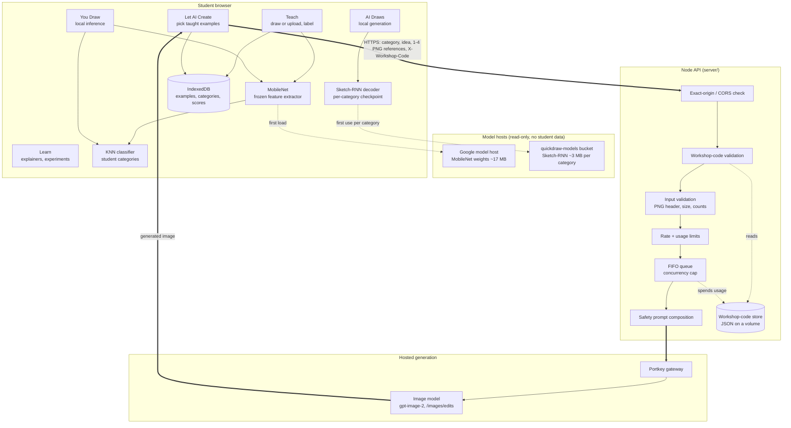
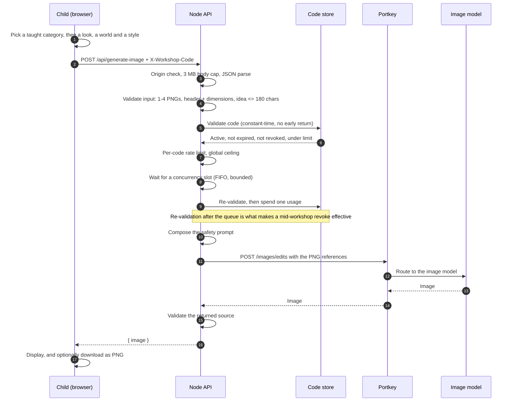
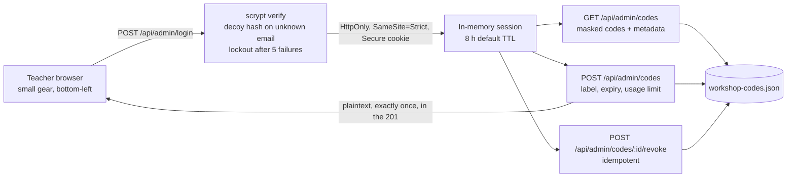
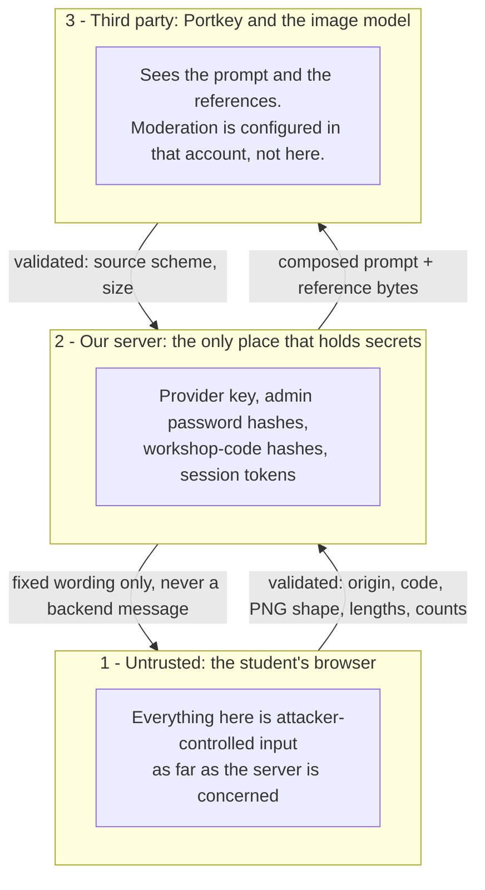

# Architecture

AI Doodle Lab is a browser-first application with one small server behind it. Almost everything a
student does runs on their own device; a single feature — **Let AI create** — reaches out to a
hosted image model, and that path is the only one with a server, a credential and a rate limit on
it.

That split is not an accident of hosting. It is the thing the workshop is trying to teach, so the
code keeps the boundary explicit and so does this document.

## System overview

The thick arrows are the only path on which anything a student made leaves their device.

## Component responsibilities

### Browser

| Area | Module | Responsibility |
| --- | --- | --- |
| Feature extraction | `src/ml/classifier.ts` | Loads MobileNet once, turns a 224×224 canvas into an embedding. Weights are never modified. |
| Classification | `src/ml/classifier.ts` | KNN over the embeddings of the student's own labelled examples. Returns class scores, not calibrated probabilities. |
| Image pipeline | `src/ml/imageProcessing.ts` | The one shared path from canvas or uploaded file to the 224×224 tensor, so Teach and You Draw cannot drift apart. |
| Startup | `src/ml/loadStages.ts` | Named loading stages, so a slow model download reads as progress rather than a frozen screen. |
| Sketch generation | `src/generative/sketchGenerator.ts` | A decoder-only Sketch-RNN runtime (~250 lines) on the TensorFlow.js already in the bundle. |
| Model memory | `src/generative/modelCache.ts` | Bounded LRU, five checkpoints, disposes tensors — a long workshop cannot grow unbounded. |
| Generation client | `src/generative/imageApi.ts` | The only module that calls our API. Owns every message a child can see; never holds a provider key. |
| Saving a picture | `src/generative/downloadImage.ts` | `data:` straight to an anchor, `https:` fetched to a blob first. Re-validates the source scheme. |
| Admin client | `src/admin/adminApi.ts` | Teacher routes. Holds no credential; the session is an `HttpOnly` cookie. |
| State | `src/hooks/useAiLab.ts` | All app state and actions in one place. |
| Persistence | `src/storage/db.ts` | IndexedDB: categories, examples, thumbnails, session scores. |

### Server (`server/`)

| Module | Responsibility |
| --- | --- |
| `index.mjs` | HTTP routing, body limits, CORS, boot-time config validation, health. Reads the environment exactly once. |
| `generation.mjs` | Input validation, safety-prompt composition, the Portkey adapters, output validation. |
| `codes.mjs` | Workshop-code generation, hashing, constant-time matching, usage claiming. |
| `store.mjs` | The atomically written JSON store, serialised through one promise chain. |
| `admin.mjs` | Admin parsing, scrypt verification, sessions, cookies. |
| `queue.mjs` | Concurrency limiter, FIFO queue with a bounded wait, per-code rate limiter. |

Every module under `server/` imports only `node:` built-ins. The backend has no dependencies to
install, which is why `Dockerfile.server` has no `npm ci` step.

## Browser / backend boundary

| Stage | Where it runs | What leaves the device |
| --- | --- | --- |
| Teach | Browser | Nothing. Examples and embeddings stay in IndexedDB. |
| You Draw | Browser | Nothing. MobileNet weights are downloaded on first load; no drawing is uploaded. |
| AI Draws | Browser | Nothing. A ~3 MB checkpoint is downloaded the first time a category is used; generation is local. |
| Let AI Create | Browser **and** backend | The chosen category name, the three-option idea string, and up to four PNG thumbnails of examples the student taught. |
| Learn | Browser | Nothing. |
| Admin | Browser and backend | The teacher's email and password on sign-in; afterwards a session cookie. |

Two things that are easy to get wrong:

- "Local" does not mean "offline". The first load needs network for the MobileNet weights, and each
  Sketch-RNN category needs network the first time it is used. A browser may cache both, but
  caching is not a guarantee — do not plan a session around the app working without network.
- "Hosted" does not mean "stored". The backend holds a student's references only for the life of the
  request. Nothing about a student is written to disk.

## Data flow: Let AI Create

A usage is spent at the moment a provider call is about to start, never when a request merely
arrives. Rejected input, a bad code, a full queue, a queue timeout or a client that disconnects
while waiting all cost nothing. A provider call that started and then failed **does** cost a
usage, because a call that reached the provider is a call that may have been billed.

## Teacher / admin path

The gear button is deliberately small and faded so it does not compete with the workshop, but that
is tidiness, not security: every route behind it is authenticated on the server. Sessions live in
memory, so a backend restart signs teachers out — codes survive it, sessions do not.

## Persistence

| Data | Where | Survives |
| --- | --- | --- |
| Categories, examples, thumbnails, session scores | Browser IndexedDB | Reloads on that device. Cleared by **Reset AI**. |
| Workshop codes and usage counters | One JSON file on the backend's persistent volume | Backend restarts and redeploys, provided the volume is mounted. |
| Admin sessions | Backend memory | Nothing. A restart ends them. |
| Student drawings, prompts, generated images | **Nowhere server-side** | n/a — they are never written to disk. |

The store is one file written atomically: a temp file in the same directory, then `rename`. All
reads and writes go through a single promise chain, so a read-modify-write from one request cannot
interleave with another's — that is what keeps the usage counter honest while four generations run
at once. A missing file initialises an empty store; a **malformed** file does not. Every entry is
validated on load, and anything unexpected makes the store refuse to serve rather than silently
voiding every class's code and usage history.

## External dependencies

| Dependency | Used for | Student data sent |
| --- | --- | --- |
| Google model host (TensorFlow.js) | MobileNet weights, first load | None |
| `quickdraw-models` bucket | Sketch-RNN checkpoints, lazily per category | None |
| Portkey | Gateway to the image model | Category name, idea string, 1–4 PNG references |
| Image model behind Portkey | Generating the picture | The same, via Portkey |

## Trust boundaries

What each boundary enforces:

1. **Browser → server.** No secret is ever in the frontend bundle; `VITE_*` variables are public by
   construction. The server re-derives everything it needs from its own environment and treats the
   request body as hostile: exact-origin check, 3 MB cap enforced by destroying the socket rather
   than buffering, PNG magic bytes and `IHDR` dimensions checked per reference, 1–4 references,
   180-character ideas, 60-character category names.
2. **Server → provider.** The provider base must be `https:`. `IMAGE_QUALITY` and `IMAGE_SIZE` are
   checked against fixed allow-lists both at boot and again inside `generate`, so a typo stops the
   server rather than quietly changing what is billed. The child's text is embedded as JSON and
   explicitly labelled untrusted and non-instructional, under a safety clause that outranks it.
3. **Provider → browser.** The returned image source is validated before it reaches an `` or a
   download anchor. Error wording shown to a child comes from a fixed map in
   `src/generative/imageApi.ts`, never from a response body, so a surprising provider error cannot
   put unexpected text on a workshop screen.

Nothing logs a provider key, a password, a full workshop code or a student image. There is a test
that asserts it.

## Known structural limits

- **Single instance.** The code store is one local file, and the queue, sessions and limit counters
  are per process. Two replicas would each have their own. This is a deliberate trade: see
  [deployment](deployment.md#single-instance-limitation).
- **Prompt wording is not moderation.** It is one layer. Provider-side moderation must be enabled in
  the Portkey workspace and the model's own configuration; this repository cannot set it.
- **Class scores are not probabilities.** The KNN numbers show how strongly each category matched.
  They are shown because they make the comparison visible, not because they are calibrated.

## Further reading

- [Picture making: Demo, Live, and the workshop admin panel](image-generation.md) — the detailed
  image-generation, workshop-code and security document.
- [Deployment](deployment.md) — the current production topology.
- [Workshop runbook](workshop-runbook.md) — the operational checklist.
