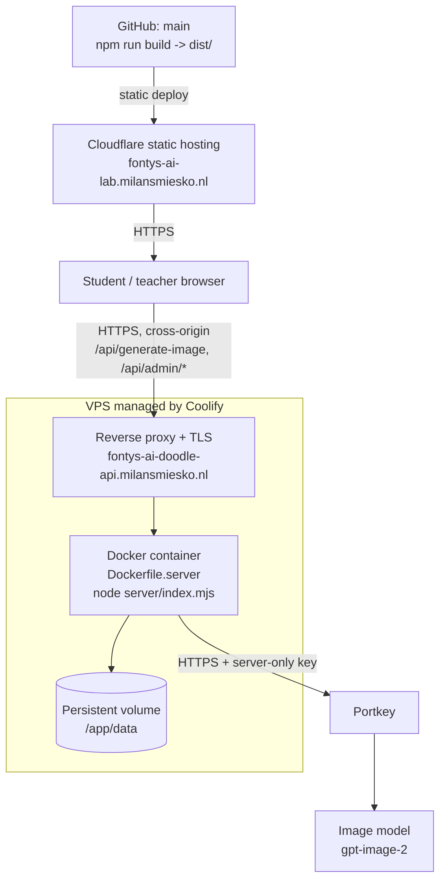

# Deployment

How AI Doodle Lab is deployed today, what each piece needs, and what the current topology cannot do.

The frontend and the backend are deployed separately and independently. That is a consequence of
what they are — a static bundle and a long-running process — not a requirement of the application.
The [roadmap](../README.md#roadmap) describes the portable single-origin alternative.

## Current production topology



| Piece | What it is | Where it is configured |
| --- | --- | --- |
| Frontend | The Vite build output, `dist/` | Cloudflare dashboard, outside this repository |
| Backend | `Dockerfile.server`, one container | Coolify on the VPS |
| TLS and routing | Reverse proxy in front of the container | Coolify |
| Persistence | A volume mounted at `/app/data` | Coolify |
| Image generation | Portkey, `/images/edits`, `gpt-image-2` | The Portkey workspace |

Production currently runs `IMAGE_QUALITY=medium` and `IMAGE_SIZE=1024x1024`.

### Cloudflare is a choice, not a dependency

Nothing in the application needs Cloudflare. The frontend is a plain static bundle with a single
entry point and no server-side rendering, no edge functions, no `_worker.js`, no `_routes.json` and
no framework adapter. Any static host — Netlify, Pages, S3 plus a CDN, Nginx, or a container
serving `dist/` — works identically.

The two things a host must do:

- Serve `dist/` with SPA-style fallback to `index.html`.
- Serve it over https from the exact origin the backend is told about in `APP_ORIGIN`.

The same is true of Coolify: it is a convenient way to run a Docker container with a volume and a
TLS reverse proxy. Any Docker host does the job.

## The backend container

`Dockerfile.server` builds the backend **only**. The Vite frontend is deliberately not built into
it: it is a static bundle that belongs on the static host, and building it would pull TensorFlow and
React into an image that never serves them.

There is also no `npm ci`. Every module under `server/` imports only `node:` built-ins, so the
backend has no package to install — the dependencies in `package.json` belong to the browser bundle.
The image is `node:24-alpine` plus `server/`.

```bash
docker build -f Dockerfile.server -t ai-doodle-api .
docker run -d --name ai-doodle-api \
  -p 3000:3000 \
  -v ai-doodle-data:/app/data \
  --env-file .env.server.local \
  ai-doodle-api
```

Baked-in defaults, all overridable at runtime:

| Variable | Default in the image | Why |
| --- | --- | --- |
| `NODE_ENV` | `production` | — |
| `HOST` | `0.0.0.0` | The server defaults to `127.0.0.1`, which inside a container means nothing outside it can connect. |
| `PORT` | `3000` | Matches `EXPOSE`. |
| `WORKSHOP_STORE_PATH` | `/app/data/workshop-codes.json` | The mount point for the persistent volume. |

The image runs as the unprivileged `node` user, and `/app/data` is created owned by that user so a
fresh named volume mounted there inherits the ownership and stays writable.

### The persistent volume is not optional

Mount a volume at `/app/data`. Without one, every redeploy starts with an empty store: every
workshop code stops working and every usage counter resets. That is the difference between handing
out a code the week before a workshop and handing one out ten minutes before it.

### Healthcheck

The container's `HEALTHCHECK` calls the server's own `/api/health`, so an unreadable code store or a
missing provider configuration shows up as an unhealthy container rather than a surprise at the
start of a workshop.

## The health endpoint

`GET /api/health` is unauthenticated and returns booleans only — never a key, a code or an email.

```bash
curl -s https://fontys-ai-doodle-api.milansmiesko.nl/api/health
```

```json
{ "status": "ok", "configured": true, "adminConfigured": true, "storeReadable": true }
```

| Field | Meaning |
| --- | --- |
| `status` | The process is answering. |
| `configured` | A provider key and model are set, at least one admin exists, and the store is readable. This is the one to check before a workshop. |
| `adminConfigured` | `ADMIN_USERS_JSON` parsed into at least one admin. |
| `storeReadable` | The code store loaded and validated. `false` means a malformed file — the server is failing closed and leaving it untouched. |

`configured: false` means Live picture making will answer `503`. The app keeps working; children see
"Picture making is not ready right now. Ask your workshop teacher."

## Environment variables

Full annotated lists live in [`.env.example`](../.env.example) (frontend) and
[`.env.server.example`](../.env.server.example) (backend). By category:

### Frontend, build time — public by construction

Compiled into the bundle. **Never put a secret in a `VITE_*` variable.**

| Variable | Production value shape |
| --- | --- |
| `VITE_IMAGE_MODE` | `live` |
| `VITE_IMAGE_ENDPOINT` | The backend's absolute https URL ending in `/api/generate-image` |
| `VITE_ADMIN_ENDPOINT` | Optional. Defaults to `VITE_IMAGE_ENDPOINT` minus `/generate-image`, which is right whenever both are on the same server. |

### Backend, runtime

**Secrets — server-only, never committed, never echoed:**
`PORTKEY_API_KEY`, `ADMIN_USERS_JSON` (scrypt hashes, generated with
`npm run admin:hash-password -- you@example.com`).

**Required for Live mode:** `APP_ORIGIN` (the exact frontend origin, scheme and port included),
`IMAGE_MODEL`, `IMAGE_OPERATION`, and one of `PORTKEY_CONFIG_ID` / `PORTKEY_VIRTUAL_KEY`.

**Strongly recommended in production:** `WORKSHOP_STORE_PATH` on the mounted volume, and
`TRUST_PROXY=1` because a reverse proxy sits in front. Without `TRUST_PROXY=1` every request looks
like it comes from the proxy, and a handful of wrong passwords would lock out all admins for fifteen
minutes. With it but *without* a proxy, a client could forge its own address — which is why it is
off by default.

**Cost and capacity:** `IMAGE_MAX_CONCURRENCY`, `IMAGE_QUEUE_LIMIT`, `IMAGE_QUEUE_WAIT_MS`,
`IMAGE_PROVIDER_TIMEOUT_MS`, `IMAGE_GLOBAL_REQUEST_LIMIT`, `IMAGE_CODE_RATE_LIMIT`,
`IMAGE_CODE_RATE_WINDOW_MS`.

**Generation parameters:** `IMAGE_QUALITY` and `IMAGE_SIZE`, each validated against a fixed
allow-list at boot. A value outside it stops the server with a clear message rather than reaching
the provider and being silently reinterpreted or billed at an unintended size.

**Networking and sessions:** `PORT`, `HOST`, `PORTKEY_BASE_URL`, `PORTKEY_PROVIDER`,
`WORKSHOP_CODE_PREFIX`, `ADMIN_COOKIE_SECURE`, `ADMIN_SESSION_TTL_MS`, `ADMIN_MAX_FAILURES`,
`ADMIN_LOCKOUT_MS`.

No session secret is needed: tokens are random and held server-side.

### Cross-origin specifics

Frontend and backend are on different hostnames today, so:

- `APP_ORIGIN` must be exactly `https://fontys-ai-lab.milansmiesko.nl`. The server refuses any
  request with a different `Origin`, and admin `POST`s require an exact match — that, together with
  `SameSite=Strict`, is the CSRF defence.
- Admin cookies are `Secure` automatically because `APP_ORIGIN` is https.
- `VITE_IMAGE_ENDPOINT` must be the backend's absolute URL. `src/admin/adminApi.ts` derives the
  admin base from it, so `VITE_ADMIN_ENDPOINT` is not needed.

## Redeploy and rollback

### Frontend

A static bundle, so rollback is whatever the host offers — redeploy a previous build or revert the
commit on `main`. Nothing stateful is involved. Changing `VITE_IMAGE_MODE` or `VITE_IMAGE_ENDPOINT`
requires a **rebuild**, not a restart: they are compile-time constants.

### Backend

Redeploying replaces the container.

- **Keep the volume.** Codes and usage counters live on it; a redeploy without it is a silent reset.
- **Sessions do not survive.** Teachers signed into the admin panel are signed out. Codes are fine.
- **The queue does not survive.** Generations in flight are lost. Redeploy between classes, not
  during one.
- **Counters reset.** `IMAGE_GLOBAL_REQUEST_LIMIT` and the per-code rate-limit windows are in-memory
  and start fresh. Per-code *usage* counters are on disk and do not.
- **Check health afterwards.** `configured: true` before the next class, not during it.

Rolling back is redeploying the previous image. Because the store validates every entry on load and
the shape has not changed, the same volume serves either version.

### Changing environment variables

A boot-time validation failure stops the process with a message rather than starting in a broken
state — an invalid `IMAGE_QUALITY`, `IMAGE_SIZE`, a non-integer limit or malformed
`ADMIN_USERS_JSON` all fail loudly. If a container will not start after an environment change, that
is the first place to look.

## Single-instance limitation

**Run exactly one backend instance.** Three pieces of state are per process or per file:

| State | Scope | Effect of a second replica |
| --- | --- | --- |
| Workshop-code store | One local JSON file | Each replica has its own. A code minted on one is unknown to the other; usage counters diverge. |
| Admin sessions | Memory | A teacher signed in on one replica is signed out on the other. |
| Queue, global ceiling, rate-limit windows | Memory | Effective concurrency and ceilings multiply by the replica count. |

This is deliberate. The alternative on the morning of a workshop is standing up PostgreSQL or Redis
and a shared session store, and the workshop does not need it: one small Node process serves a class
of fifteen comfortably at `IMAGE_MAX_CONCURRENCY=4`.

The consequence worth repeating: `IMAGE_GLOBAL_REQUEST_LIMIT` resets on restart and is not shared,
so a **provider-side spending cap remains the authoritative budget.** Set one in the Portkey
workspace.

Multi-instance support is on the [roadmap](../README.md#roadmap), not in the code.

## Also see

- [Architecture](architecture.md) — components, boundaries and trust boundaries.
- [Picture making](image-generation.md) — codes, limits, safety and model compatibility.
- [Workshop runbook](workshop-runbook.md) — what to check before, during and after a session.
