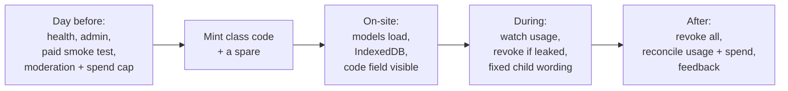

# Workshop runbook

The operational checklist for running a session. It assumes production is already deployed — see
[deployment](deployment.md) if it is not.

Read this the day before, not the morning of.

**Production URLs**

| | |
| --- | --- |
| Frontend | <https://fontys-ai-lab.milansmiesko.nl/> |
| Backend health | <https://fontys-ai-doodle-api.milansmiesko.nl/api/health> |

---

## Before the workshop

### The day before

**1. Frontend reachable.** Open the live site. It should load and reach the Teach stage.

**2. Backend healthy.**

```bash
curl -s https://fontys-ai-doodle-api.milansmiesko.nl/api/health
```

Expect `configured: true`, `adminConfigured: true`, `storeReadable: true`. Anything else is a
blocker, not a warning:

| Response | Meaning | Action |
| --- | --- | --- |
| No response | Container down or proxy misrouting | Check the Coolify deployment and the container logs |
| `storeReadable: false` | The code store is malformed; the server is failing closed | Inspect the volume. Do not delete the file — it is the only copy of every code and counter |
| `adminConfigured: false` | `ADMIN_USERS_JSON` missing or unparseable | Regenerate with `npm run admin:hash-password` |
| `configured: false`, others true | Provider key or model missing | Check `PORTKEY_API_KEY` and `IMAGE_MODEL` |

**3. Admin access.** Open the small ⚙ at the bottom-left of the live site and sign in. If sign-in
answers `429`, a lockout is active — it clears after `ADMIN_LOCKOUT_MS` (fifteen minutes by
default), or sooner if the backend is restarted.

**4. Provider generation smoke test.** The only check that proves the whole path works. Mint a
throwaway code with a usage limit of 2, teach one category one example, and create one picture.
A picture that appears means code validation, the queue, the prompt, Portkey, the model and output
validation all work. Revoke the throwaway code afterwards.

Do this **before** minting the real class code. It is the one check that costs money, and it is
worth every cent compared with finding out in front of a class.

**5. Moderation and safety settings confirmed.** The composed prompt carries an explicit safety
clause, but **prompt wording is not moderation.** Confirm, in your Portkey workspace and in the
underlying model's own configuration, that the moderation/safety settings are enabled on the route
you use. Those live in the provider account; this repository cannot set them and does not claim to.

Also confirm a **provider-side spending cap** is set. `IMAGE_GLOBAL_REQUEST_LIMIT` resets on
restart and is not the authoritative budget.

**6. Mint the class code.** In the admin panel: label it after the class (`Workshop Group A`), set
the expiry (8 hours covers a workshop day) and the usage limit.

> **The full code is shown exactly once, in the response that creates it.** Copy it immediately.
> Afterwards the panel only shows a masked form such as `FONTYS-A7•••`. There is deliberately no way
> to reveal it later: a lost code is replaced, not recovered.

Sizing the usage limit: one picture per child plus room to retry. For fifteen children, 30–45 is
comfortable. A limit that is too low stops the class; too high and a stuck tab can burn the budget.

**7. Have a replacement ready.** Mint a second code, keep it on paper, and do not hand it out. If
the first leaks or runs out mid-session you are thirty seconds from recovery instead of signing into
an admin panel in front of thirty children.

### On the workshop network, on the actual devices

**8. Network and model loading.** On at least one device per room, on the workshop Wi-Fi:

- Load the app and let the initial model finish — MobileNet is ~17 MB from Google's model host.
- Open **AI Draws** once, so a Sketch-RNN checkpoint (~3 MB) downloads. This verifies the network
  allows the model host, which is the most common school-network surprise.
- Confirm the browser can use IndexedDB. The app warns on screen if it cannot.
- Open **Let AI create** and confirm the workshop-code field appears. If it says "Picture making is
  not connected yet", the frontend was built without `VITE_IMAGE_ENDPOINT` — that needs a rebuild,
  not a restart.
- If children will use the QR handoff, check that a phone on the room's Wi-Fi (or on mobile data)
  can actually reach the backend's https origin. The QR points at the backend, not at the site, and
  a guest network that blocks it is the one thing that breaks this feature silently.

Doing this once per device before the workshop is the single biggest reliability win. A browser may
cache the models, making later loads faster — but caching is not a guarantee, so keep network
available and do not plan the session around the app working offline.

---

## During the workshop

**Monitor usage.** The admin panel lists each code with `usageCount / usageLimit`. Glance at it
between activities. Approaching the limit means minting a fresh code, not raising the old one —
limits are set at creation.

**Revoke if a code gets out.** Revocation is immediate and effective even for requests already
waiting in the queue: a queued request is re-validated after it leaves the queue, so it is still
refused. Revocation is permanent — a revoked code never comes back. Hand out the replacement from
step 7.

**Provider busy or failing.** Children only ever see fixed, friendly wording; no backend message
reaches a workshop screen.

| What the child sees | What it means | What to do |
| --- | --- | --- |
| "Lots of pictures are being made right now. Wait a moment and try again." | Queue full, or a 120 s queue wait expired | Normal under load. Stagger the class; have children pick their options while they wait |
| "The workshop picture limit has been reached. Ask your teacher to reset it." | The global process ceiling | Restart the backend to clear it, or raise `IMAGE_GLOBAL_REQUEST_LIMIT` — but check the provider spend first |
| "That workshop code has made all of its pictures." | Per-code usage limit spent | Mint a new code |
| "That workshop code has finished for today." | Expired | Mint a new code |
| "That workshop code is not in use any more." | Revoked | Hand out the replacement |
| "Picture making is not ready right now." | Backend `503` — provider not configured, or the store is unreadable | Check `/api/health` |
| "That took too long. Please try again." | 240 s client timeout | Usually load. Retry once |

| "This phone link has expired. Create a new picture to get a new one." | The QR link's ~30-minute life ran out, or the backend restarted | Expected. The picture is still on screen and still downloadable; a new generation gives a new link |

**Phone handoff.** After a picture is made, children can scan the QR code under **📱 Save it on
your phone** instead of downloading to the booth machine. The link lives about 30 minutes, works
without the workshop code (the phone does not have one), and dies if the backend restarts. Nothing
is published: the link is unguessable and temporary, and the picture is never written to the
backend's disk.

**Keep an adult watching the screen.** The usage limits exist partly so a bad result can be stopped
by revoking a code rather than by waiting for anything to time out.

### The suggested activity

A ten-minute core loop that works at a booth or in a classroom:

1. Give each category just **two** examples. The starter set is random — for example Cat, House and
   Tree — and can be renamed or replaced.
2. Test the AI in **You Draw**.
3. Observe where it gets confused.
4. Add more, and more **varied**, examples for the categories it struggled with.
5. Test again.
6. Discuss: what changed, and why?

> **The question to ask:** "What kind of data helped your AI improve?"

Then, if picture making is available, move to **Let AI Create** and ask the second question: "Your
tablet recognised your drawing by itself — why does making a picture need the internet and a code
from me?"

**Teaching notes.**

- "Challenge success rate" reflects this session's challenges only — it is not a model accuracy
  metric.
- The percentages next to a guess are **class scores, not calibrated probabilities.**
- On the Learn page, "Show me" uses a picture the AI already learned from, and says so on screen.
  "Or draw something new" is the genuinely unseen test.
- **Reset AI** clears every example, category and score on that device — and the latest generated
  picture with them — and confirms first. Run it between groups at a booth.
- The latest generated picture stays on the device until then: a child can wander to another
  challenge and come back to it, and it survives a page reload. Only the most recent one is kept.
- The workshop code is hidden behind dots, with a **Show** button. Children who mistype it can check
  what they typed; remind them to hide it again if the screen is shared.
- Point out the notice above Let AI create: it is the moment the workshop's local/hosted distinction
  stops being abstract.

**Do not redeploy during a class.** It drops queued generations, signs teachers out, and
invalidates every QR phone link handed out so far (codes and usage counters survive).

---

## After the workshop

**1. Revoke every code handed out.** Including ones that look exhausted or expired. It is one click
and it closes the session properly.

**2. Check for unexpected usage.** Compare each code's final `usageCount` against roughly what the
class made. A large gap is worth understanding before the next session.

**3. Check the provider dashboard.** Actual spend against expected spend, in the Portkey workspace.
This is the authoritative number.

**4. Record observations.** What the AI confused, which categories worked, where children got
stuck, how long each stage actually took, anything that surprised you about the network or devices.

**5. Capture feedback** from students and the teacher while it is fresh.

**6. Note anything that needs a code change** as an issue rather than fixing it the same evening.

---

## Quick reference



## Also see

- [Picture making](image-generation.md) — codes, limits, safety and model compatibility in detail.
- [Deployment](deployment.md) — topology, environment variables, redeploy and rollback.
- [Architecture](architecture.md) — what runs where.
- [Workshop feedback](workshop-feedback.md) — observations from real sessions, and what they changed.
